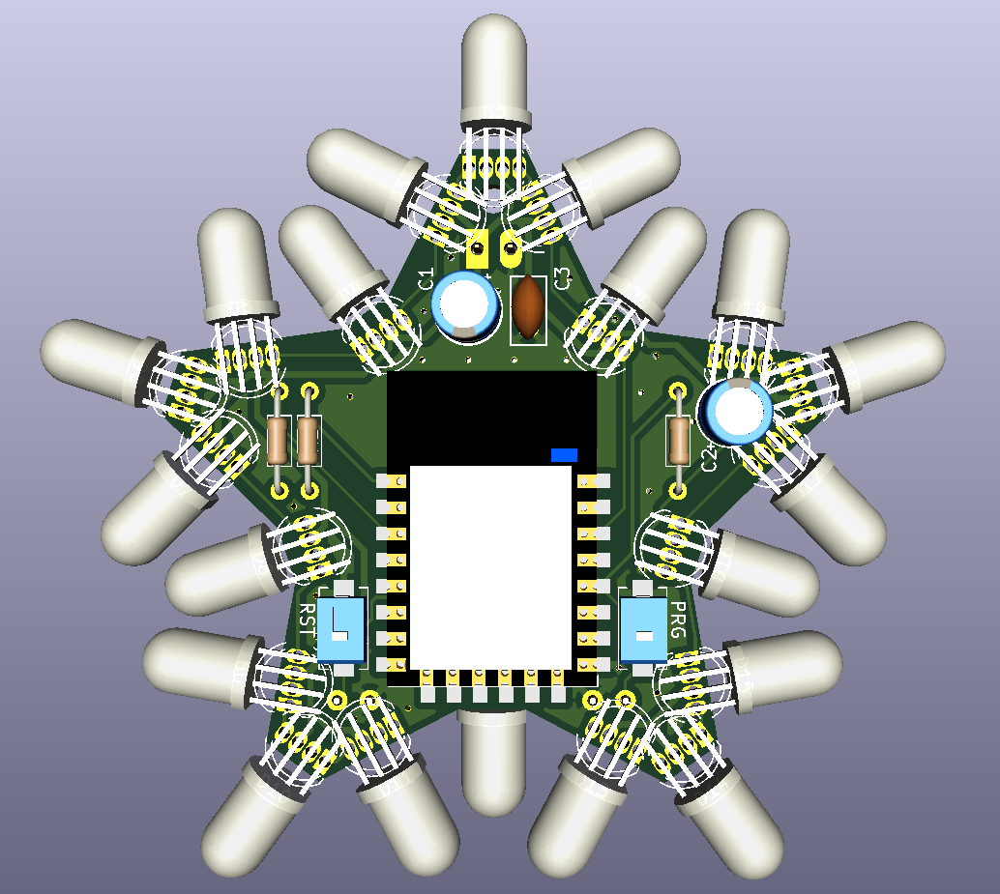
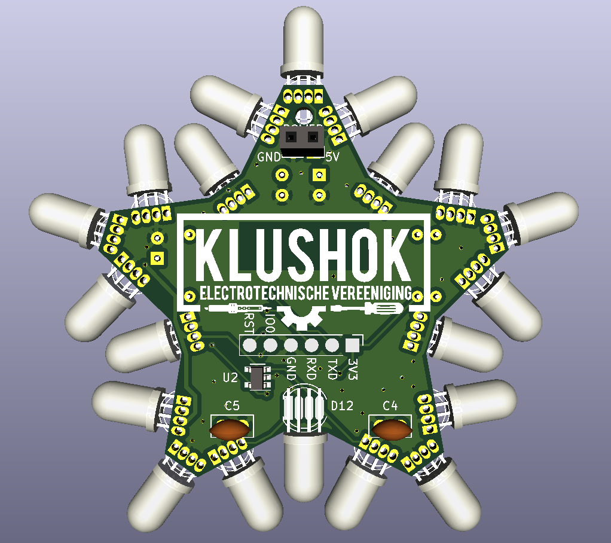

# christmas 2021
The PCB outline can be generated from the included svg file `star template` using the [svg2shenzen](https://github.com/badgeek/svg2shenzhen) plugin.

For the list of To-Do's check [the TODO list](https://github.com/klushok-etv/christmas2021/projects/1), feel free to add any issues or tasks as well!

## current idea
ESP12F has 15 (17 including rx tx) gpio available. There are 45 signals required to controll each color individually. By combining the same color every 5 leds, all leds can be controlled. Issue that remains is the current requirement per GPIO which far exceeds the limit of the pin.
The current can be increased by adding transistors/fets or something like 2 of the ULN2803 and common anode leds.

ESP kicad lib: [https://github.com/jdunmire/kicad-ESP8266](https://github.com/jdunmire/kicad-ESP8266). -> this library has most models but the centers of the pads are located in an odd place. the symbol is also not colored.

## Current design
This design makes use of the APA106 leds which are pincompatible with the pl9823 when pin 1 is attached to pin 4 etc. Both of these led types can be controlled as if they were a WS2812.

The two buttons are reset and io0, required for programming. 
IO0 can also be used as a user input pin.

THT components have been chosen where possible to easy soldering by hand. 
Components with a SMD package are still solderable by hand, using a tweezer is advised.

Power is fed through to the connectors at the top of the pcb, a jst or other connector can be soldered in place to ensure polarity is correct. No reverse polarity protection is in place!

The star can be programmed using the pads on the back. Wires can be soldered to the pads or pogo pins could be used.

The committee might make a custom programmer to ease flashing for the first time after which OTA/wifimanager can be uploaded. An anternative idea for the firmware might be [WLED](https://github.com/Aircoookie/WLED).

## Possible parts
- ESP32 wroom/wrover -> most expensive and biggest option but has plenty of IO, does require a pad to be soldered so hot air is required
- ESP01 -> very few pins but cheap
- ESP M3 -> based on the 8285 chip with low memory and only a few GPIO's but has a small footprint and is cheap
- ESP12F/E -> Good option but almost same price as ESP32 but reduced functionality and soon to be replaced by ESP32-C3 [https://www.aliexpress.com/item/32963951195.html](https://www.aliexpress.com/item/32963951195.html)
- pl9823 led [https://nl.aliexpress.com/item/32963082574.html](https://nl.aliexpress.com/item/32963082574.html)
- APA106 led [https://www.aliexpress.com/item/4001066329177.html](https://www.aliexpress.com/item/4001066329177.html)
- buttons for reset and gpio0, 3x6x2.5mm: [https://www.aliexpress.com/item/32696590759.html](https://www.aliexpress.com/item/32696590759.html)
- angled clamp [https://www.aliexpress.com/item/1005002240862072.html](https://www.aliexpress.com/item/1005002240862072.html)
- usb c connectors [https://www.aliexpress.com/item/1005001283294686.html](https://www.aliexpress.com/item/1005001283294686.html)
